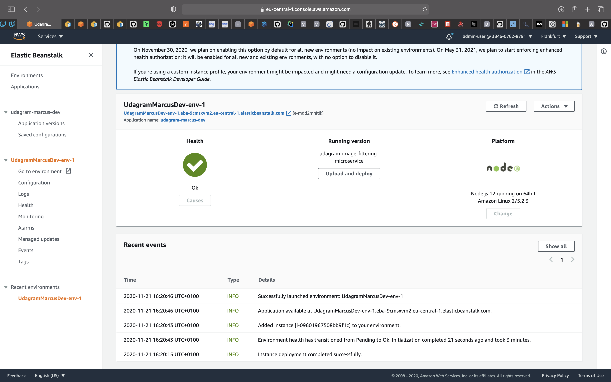

# Udagram Image Filtering Microservice

Udagram is a simple cloud application developed alongside the Udacity Cloud Engineering Nanodegree. It allows users to register and log into a web client, post photos to the feed, and process photos using an image filtering microservice.


## Develop and run the server

Ensure that you have [NodeJS](https://nodejs.org/en/) installed locally. `node -v` should display your installed version.

The first thing is to install all the required dependencies with `npm i` command.

### npm run dev

Starts the development server

### npm run build

Creates a production optimized build artifact in the `/www` folder.

### npm run format

Formats the source files with [prettier](https://prettier.io)

## cURL

The service can be access with a GET request to the `/filteredimage` endpoint with a `image_url` query parameter with a valid URL.

Localhost request
```curl
curl -X GET http://localhost:8082/filteredimage\?image_url\=https://upload.wikimedia.org/wikipedia/commons/b/bd/Golden_tabby_and_white_kitten_n01.jpg \
 -o filtered_image.jpg
```

Against the live AWS Elastic Beanstalk instance request
```
curl -X GET http://UdagramMarcusDev-env-1.eba-9cmsxvm2.eu-central-1.elasticbeanstalk.com/filteredimage\?image_url\=https://upload.wikimedia.org/wikipedia/commons/b/bd/Golden_tabby_and_white_kitten_n01.jpg \
 -o filtered_image.jpg
```


## Deployed AWS Elastic Beanstalk



