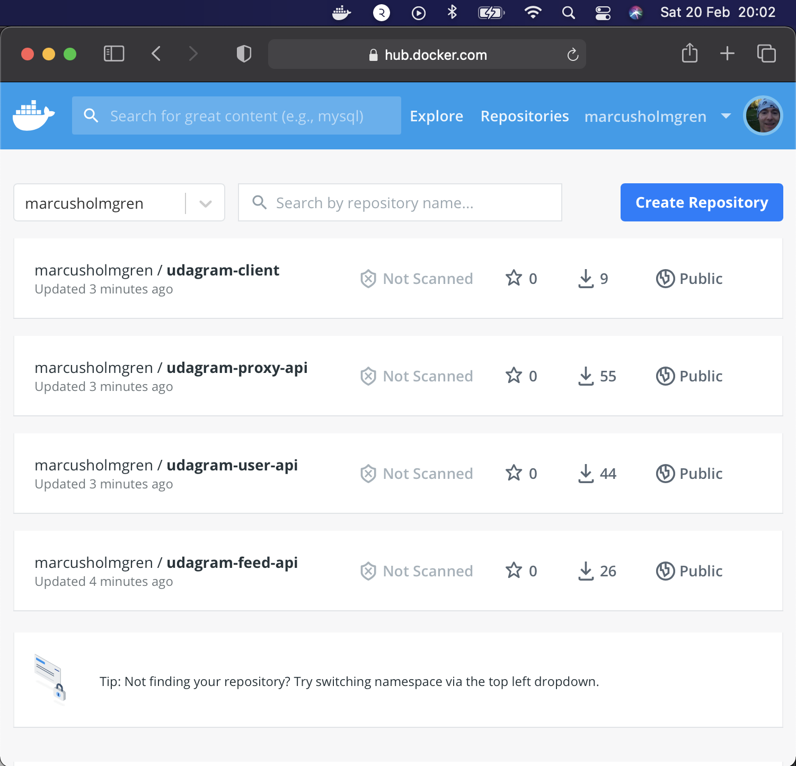
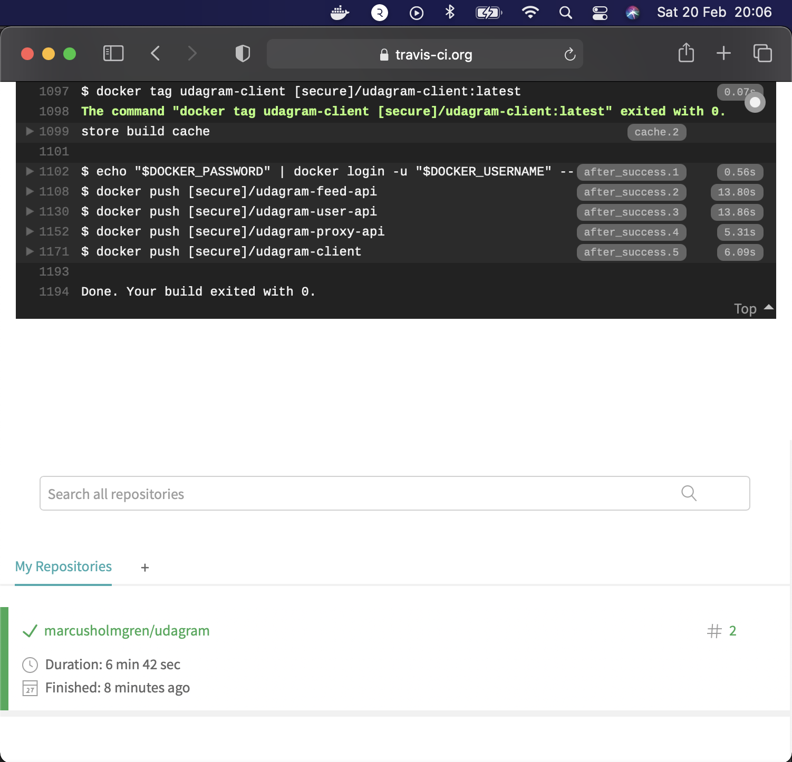
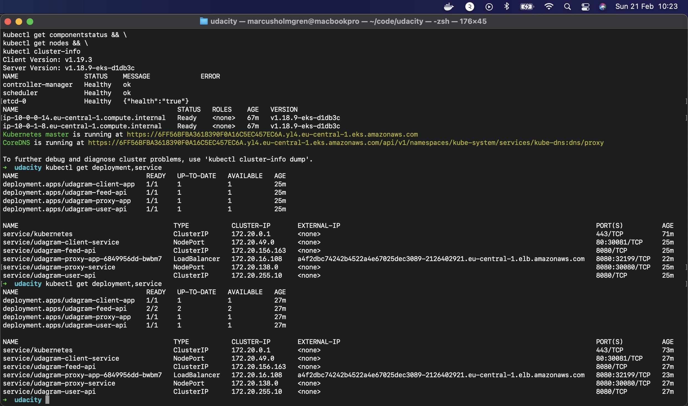
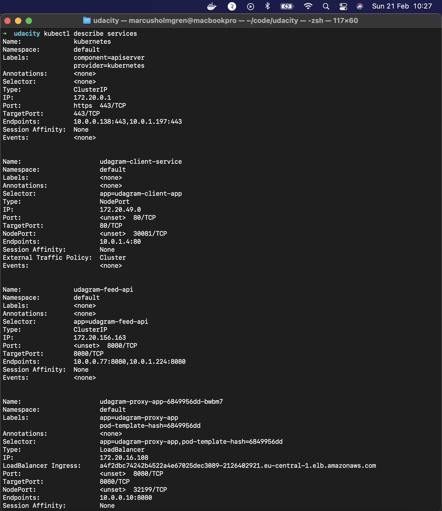
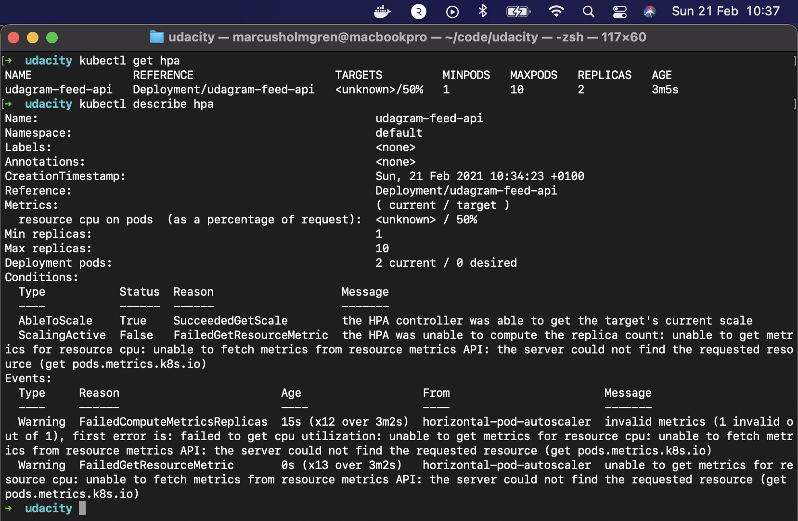
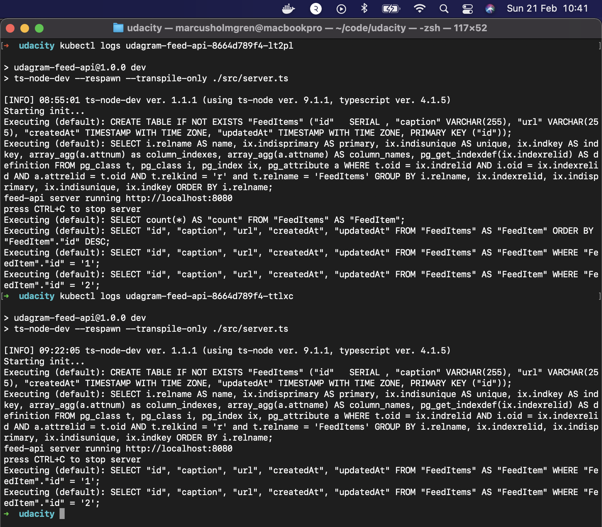
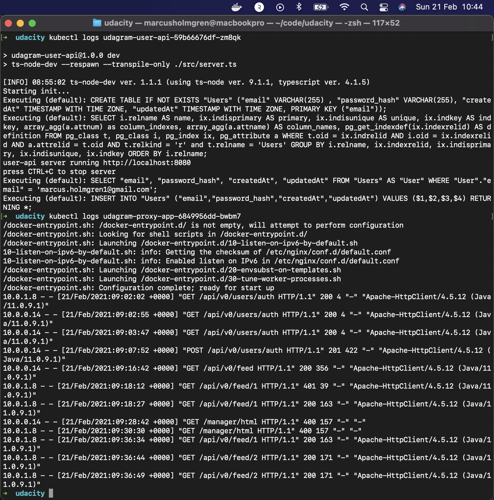

## Containers and Microservices

## Independent Releases and Deployments

## Service Orchestration with Kubernetes

deployment.apps/udagram-feed-api scaled from 1/1 to 2/2 

### Kubernetes `kubectl get pods` output

### Kubernetes `kubectl describe services` output

### Kubernetes `kubectl describe hpa` output

### Kubernetes `kubectl logs <your pod name>` output

Screenshot of Kubernetes services shows a reverse proxy

Screenshot of Kubernetes cluster of command `kubectl describe hpa` has autoscaling configured with CPU metrics.

## Debugging, Monitoring, and Logging

Both of the logs screenshots show request being accepted and processed 2021-02-21 around 09:00