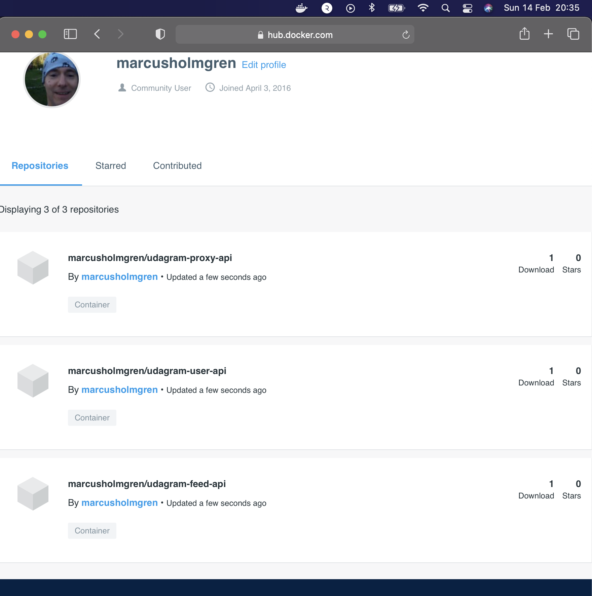
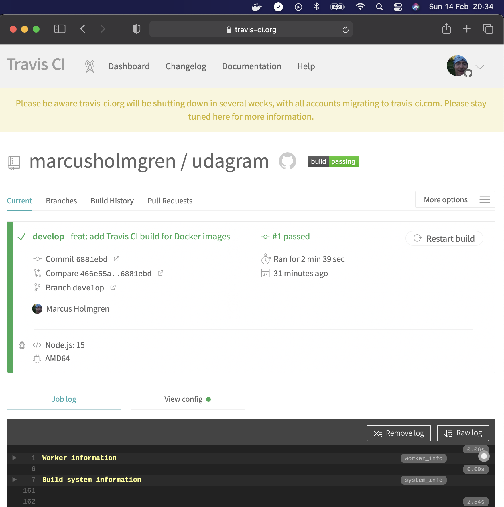

## Containers and Microservices

## Independent Releases and Deployments

## Service Orchestration with Kubernetes

Screenshot of Kubernetes services shows a reverse proxy

Screenshot of Kubernetes cluster of command `kubectl describe hpa` has autoscaling configured with CPU metrics.

## Debugging, Monitoring, and Logging

Screenshot of one of the backend API pod logs indicates user activity that is logged when an API call is made.
